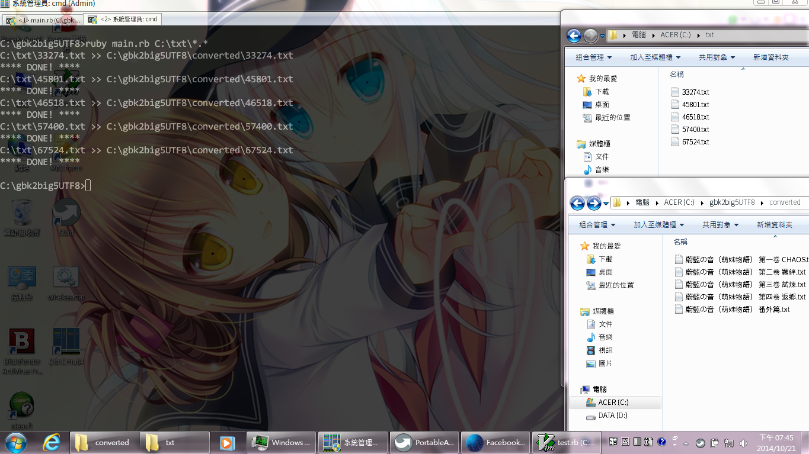
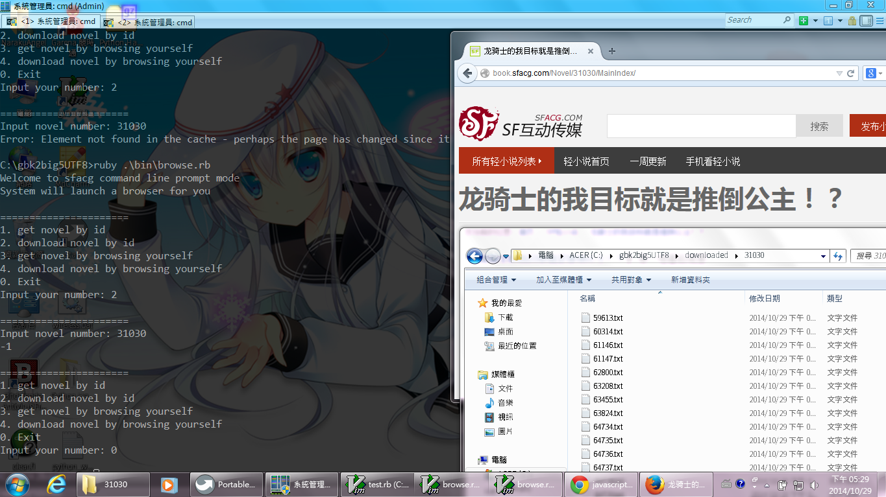

sfacg Novel Downloader
==========

What is this?
----------

This is a toolkit to download the novel by using command line.

Is it finished?
----------

Not yet? We only finished something below

* Convert zh-CN to zh-TW
* Login to sfacg
* Get novel details by number

How to use it?
----------

* First, clone the project to where you want.
* Use bundler to install needed gems.
* Copy the argument.example.json to argument.json then edit it.
* open the project in command prompt to click the command below. Then it will show the menu for you to use it.

```bash
# Converter (non-unix please use '\')
ruby ./bin/convert.rb
# Browser (non-unix please use '\')
ruby ./bin/browse.rb
```

How can you support us?
----------

If we finished and make version 1.0, then you can

* Tell us how you feel on this tools
* Help us on non-windows solution (zh-CN to zh-TW converter)
* More flextable on other novel website
* Better writing on code


ScreenShots
----------

**Converter** 


**Browser** 
